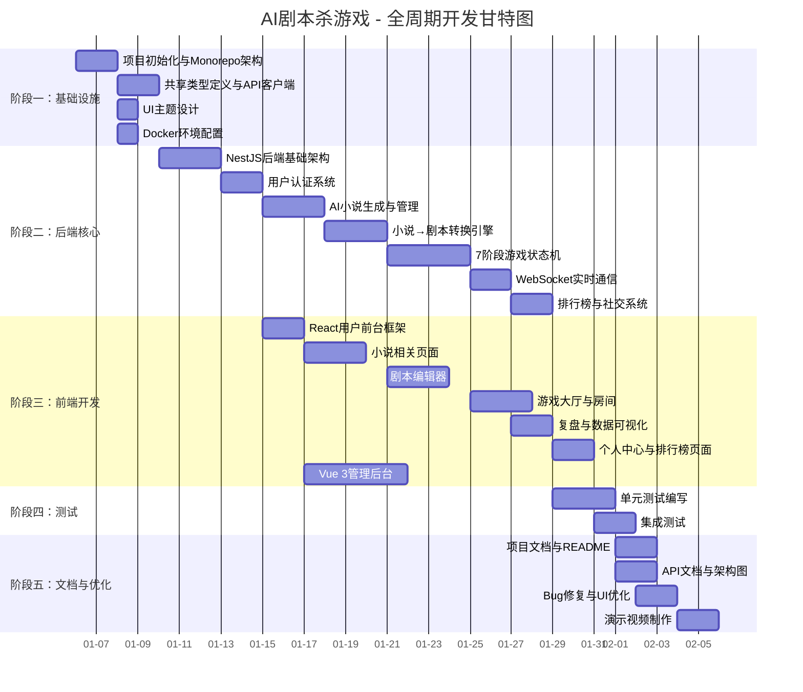

# 🎭 AI剧本杀游戏 - PR 与 Commit 规范指南

> 本文档规范了项目的 Pull Request 提交规则和 Git commit 信息格式，确保全周期持续交付，满足评审要求。

---

## 一、PR 提交总则

### 1.1 核心原则

| # | 原则 | 说明 |
|---|------|------|
| 1 | **每 PR 只做一件事** | 每个 PR 只实现或修改单一功能，杜绝"大杂烩"式提交 |
| 2 | **粒度尽可能细** | 大功能必须拆分为多个独立 PR，分步提交 |
| 3 | **标题清晰完整** | 一句话说明本 PR 新增/修改了什么 |
| 4 | **描述详尽** | 包含功能描述、实现思路、技术选型 |
| 5 | **持续交付** | 在整个开发周期内保持持续的 PR 记录，严禁最后一天突击提交 |

### 1.2 PR 标题格式

```
<type>(<scope>): <简短描述>
```

**type 类型：**

| 类型 | 说明 | 示例 |
|------|------|------|
| `feat` | 新功能 | `feat(game): 实现7阶段游戏状态机` |
| `fix` | 修复 Bug | `fix(editor): 修复YAML预览溢出问题` |
| `refactor` | 重构 | `refactor(converter): 重构剧本转换引擎` |
| `test` | 测试 | `test(game): 添加游戏状态机单元测试` |
| `docs` | 文档 | `docs(readme): 完善项目文档` |
| `chore` | 工程化 | `chore(workspace): 配置pnpm monorepo` |
| `style` | 样式 | `style(ui): 调整赛博朋克主题色` |
| `perf` | 性能 | `perf(api): 优化小说列表查询性能` |

### 1.3 PR 描述模板

```markdown
## 功能描述
[一句话说明本 PR 新增/修改了什么功能]

## 使用方式
[说明该功能的作用与使用方式，用户/开发者如何操作]

## 实现思路
### 技术选型
[选用了什么技术/库/框架，为什么]

### 核心逻辑
[简要说明核心实现逻辑和关键代码路径]

### 涉及文件
[列出本次修改的核心文件清单]
```

---

## 二、PR 拆分清单

以下将项目按功能模块拆分为 **16 个独立 PR**，按开发时间线排列：

### PR #1: 项目初始化与 Monorepo 架构

```markdown
## 功能描述
搭建 pnpm workspace Monorepo 项目架构，配置基础工程化设施

## 使用方式
`pnpm install` 安装依赖，`pnpm dev:all` 一键启动全部服务

## 实现思路
- **技术选型**：pnpm workspace 管理多包，Monorepo 架构实现共享代码复用
- **核心逻辑**：
  - 根 package.json 配置 workspace scripts
  - pnpm-workspace.yaml 声明 apps/*, packages/*, server 子包
  - tsconfig.base.json 统一 TypeScript 配置
  - .npmrc / .prettierrc / .gitignore 等基础配置

## 涉及文件
- package.json, pnpm-workspace.yaml, tsconfig.base.json
- .npmrc, .gitignore, .prettierrc
- docker/docker-compose.yml
```

### PR #2: 共享类型定义 (@asg/shared)

```markdown
## 功能描述
定义项目全局共享类型、常量和工具函数

## 使用方式
`import { Novel, GameSession } from '@asg/shared'`

## 实现思路
- 使用 TypeScript 接口定义 User, Novel, Script, Game, API 五大数据模型
- 枚举类定义 NovelStatus, Genre, GameMode, GamePhase 等常量
- API endpoints 统一管理，避免硬编码

## 涉及文件
- packages/shared/src/types/*.ts
- packages/shared/src/constants/*.ts
- packages/shared/src/utils/*.ts
```

### PR #3: API 客户端封装 (@asg/api-client)

```markdown
## 功能描述
封装 Axios HTTP 客户端，统一管理 API 请求

## 使用方式
`import { novelApi, gameApi } from '@asg/api-client'`

## 实现思路
- Axios 实例配置 JWT 拦截器，自动注入 token
- 401 响应自动清除登录状态并跳转登录页
- 按模块划分 API (novel/script/game/user)，职责清晰

## 涉及文件
- packages/api-client/src/client.ts
- packages/api-client/src/modules/*.ts
```

### PR #4: 赛博朋克 UI 主题 (@asg/ui-theme)

```markdown
## 功能描述
定义赛博朋克暗色主题的设计 tokens 和 CSS 效果

## 使用方式
`import { colors, typography } from '@asg/ui-theme'`

## 实现思路
- 颜色 tokens：暗色背景 + 霓虹绿/蓝/紫高亮
- CSS 霓虹光效动画：glow 特效 + 扫描线 + 故障闪烁
- 统一字体和间距规范

## 涉及文件
- packages/ui-theme/src/tokens/*.ts
- packages/ui-theme/src/components/*.css
```

### PR #5: NestJS 后端基础架构

```markdown
## 功能描述
搭建 NestJS 后端基础架构，配置数据库、Redis、认证等基础设施

## 使用方式
`pnpm dev:server` 启动后端服务

## 实现思路
- NestJS + TypeORM + MySQL 标准分层架构
- ConfigModule 统一管理环境变量（数据库/JWT/Redis/AI）
- 全局异常过滤器 + 统一响应拦截器
- Swagger 自动生成 API 文档

## 涉及文件
- server/src/main.ts, server/src/app.module.ts
- server/src/config/*.ts
- server/src/common/*.ts
```

### PR #6: 用户认证系统

```markdown
## 功能描述
实现 JWT 用户认证（注册/登录/权限控制）

## 使用方式
POST /api/auth/register → POST /api/auth/login → 获取 token

## 实现思路
- JWT 双令牌机制（access token + refresh token）
- Passport.js 策略 + JwtAuthGuard 守卫
- 密码 bcrypt 加密存储
- 角色守卫支持 RBAC 权限控制

## 涉及文件
- server/src/modules/auth/*
- server/src/modules/user/*
```

### PR #7: AI 小说生成与管理

```markdown
## 功能描述
实现 AI 小说生成、导入(docx)、CRUD、搜索筛选功能

## 使用方式
输入创意提示词 → AI 自动生成完整小说 → 导入/编辑/存档

## 实现思路
- 可插拔 AI 模型架构（OpenAI/Anthropic/DeepSeek）
- BullMQ 异步队列处理小说生成
- TypeORM 多表关联（Novel + NovelTag）
- 分页/搜索/排序/筛选完整查询

## 涉及文件
- server/src/modules/novel/*
- server/src/modules/ai-model/*
- server/src/queue/processors/novel-generation.processor.ts
```

### PR #8: 小说→剧本转换引擎

```markdown
## 功能描述
实现从小说文本到结构化 YAML 剧本的核心转换引擎

## 使用方式
上传小说 → 4阶段转换动画 → 生成 YAML 剧本

## 实现思路
- Zod Schema 作为剧本数据模型的 Single Source of Truth
- 转换引擎分 4 阶段：文本解析 → 角色抽取 → 场景分割 → 对白生成
- YAML 生成器 + YAML 校验器保证输出质量
- 进度事件通知前端展示动画

## 涉及文件
- server/src/modules/script/converter/*
- server/src/modules/script/schemas/*
- server/src/modules/script/entities/*
```

### PR #9: 剧本编辑器

```markdown
## 功能描述
三栏可视化 YAML 剧本编辑器，支持实时预览

## 使用方式
左侧角色面板 → 中间场景对白编辑 → 右侧 YAML 实时预览

## 实现思路
- Monaco Editor 提供 YAML 语法高亮和实时校验
- 三栏布局：角色管理 / 场景时间线 / YAML 预览
- 角色自动设定（AI 生成性格/背景/秘密/动机）
- 对白生成（基于角色性格创作自然对白）

## 涉及文件
- apps/user-portal/src/pages/ScriptEditor/*
- apps/user-portal/src/components/game/*
```

### PR #10: 7 阶段游戏状态机

```markdown
## 功能描述
实现完整的 7 阶段多人剧本杀游戏状态机引擎

## 使用方式
创建房间 → 选择角色 → 阅读剧本 → 讨论 → 指控 → 投票 → 结局

## 实现思路
- 轻量级状态机：LOBBY → INTRO → READING → DISCUSSION → ACCUSATION → VOTING → REVEAL → ENDED
- 每个阶段有独立的输入验证和超时机制
- Socket.IO 实时广播状态变更
- AI 玩家自动参与讨论和投票

## 涉及文件
- server/src/modules/game/engine/game-engine.ts
- server/src/modules/game/engine/game-state.ts
- server/src/modules/game/engine/ai-player.ts
- server/src/modules/game/room/room-manager.ts
```

### PR #11: 实时 WebSocket 通信

```markdown
## 功能描述
实现 Socket.IO 实时通信网关，支持多人游戏互动

## 使用方式
WebSocket 连接 → 加入房间 → 实时发言/投票/场景切换

## 实现思路
- Socket.IO Gateway 处理房间管理
- 事件驱动：join_room → player_move → make_choice → cast_vote → phase_change
- Redis 适配器支持多进程扩展
- 断线重连机制

## 涉及文件
- server/src/modules/game/game.gateway.ts
- apps/user-portal/src/hooks/useWebSocket.ts
```

### PR #12: 游戏大厅与房间管理

```markdown
## 功能描述
实现游戏大厅，支持创建/加入房间、匹配对手

## 使用方式
浏览房间列表 → 创建/加入房间 → 设置角色 → 开始游戏

## 实现思路
- 房间列表实时刷新（Socket.IO 订阅）
- 创建房间支持设置剧本、人数、难度
- 玩家就绪检测 + 自动开始倒计时
- AI 机器人自动补位

## 涉及文件
- apps/user-portal/src/pages/GameLobby/*
- apps/user-portal/src/pages/GameRoom/*
- server/src/modules/game/game.controller.ts
```

### PR #13: 复盘聊天室与数据可视化

```markdown
## 功能描述
实现游戏结束后的复盘聊天室和 ECharts 数据可视化

## 使用方式
游戏结束后 → 复盘模式 → 查看统计图表 → 回顾关键决策

## 实现思路
- Socket.IO 实时聊天室（支持消息存档）
- ECharts 展示：玩家发言统计 / 投票分布 / 推理准确度
- 胜负判定引擎：基于推理准确度的 G-coin 奖励系统

## 涉及文件
- server/src/modules/game/game.service.ts
- apps/user-portal/src/pages/GameRoom/index.tsx
- apps/user-portal/src/components/game/ChoicePanel.tsx
```

### PR #14: 排行榜与社交系统

```markdown
## 功能描述
实现小说排行榜（只显示已存档）和社交功能（收藏/评论/评分）

## 使用方式
浏览排行榜 → 收藏小说 → 发表评论 → 评分

## 实现思路
- 排行榜仅展示已存档小说，点击跳转详情页
- 收藏/评论/评分三表分离，TypeORM 关联
- 成就系统 + 玩家积分排行

## 涉及文件
- server/src/modules/achievement/*
- server/src/modules/social/*
- server/src/modules/notification/*
```

### PR #15: React 用户前台

```markdown
## 功能描述
React 18 + TypeScript 用户前台完整实现

## 使用方式
浏览所有用户端页面和功能

## 实现思路
- React 18 + Vite + TailwindCSS + Framer Motion
- Zustand 状态管理（auth/novel/game 分离）
- 13 个页面：首页/小说馆/生成/详情/转换/编辑/游戏大厅/房间/排行榜/个人中心/登录/注册
- 响应式设计 + 暗色主题

## 涉及文件
- apps/user-portal/src/pages/* (13个页面)
- apps/user-portal/src/components/*
- apps/user-portal/src/stores/*
- apps/user-portal/src/services/*
```

### PR #16: Vue 3 管理后台

```markdown
## 功能描述
Vue 3 + Element Plus 管理后台完整实现

## 使用方式
管理员登录 → 管理小说/用户/剧本/AI模型配置

## 实现思路
- Vue 3 Composition API + TypeScript
- Element Plus UI 框架 + 全局暗色模式
- Pinia 状态管理
- 路由守卫权限控制

## 涉及文件
- apps/admin-portal/src/views/* (7个页面)
- apps/admin-portal/src/components/*
- apps/admin-portal/src/stores/*
```

---

## 三、Commit 规范

### 3.1 格式

```
<type>(<scope>): <subject>

<body>

<footer>
```

### 3.2 完整 Commit 清单

```bash
# === 阶段一：基础设施 ===
chore(workspace): 初始化 pnpm monorepo 项目架构
  -> 配置 workspace、tsconfig、ESLint、Prettier

chore(docker): 配置 Docker Compose (MySQL + Redis + MinIO)

feat(shared): 添加共享类型定义和常量枚举

feat(api-client): 封装 Axios API 客户端 (JWT 拦截器)

feat(ui-theme): 定义赛博朋克暗色主题设计 tokens

# === 阶段二：后端核心 ===
feat(server): 搭建 NestJS 后端基础架构 (Config/TypeORM/Swagger)

feat(auth): 实现 JWT 用户认证系统 (注册/登录/守卫)

feat(user): 实现用户 CRUD 管理

feat(novel): 实现小说 CRUD 与 AI 生成功能

feat(ai-model): 实现可插拔 AI 模型架构 (OpenAI/Anthropic/DeepSeek)

feat(converter): 实现小说→剧本转换引擎 (4阶段/YZAM/Zod)

feat(script): 实现剧本数据库实体与 CRUD

feat(game): 实现 7 阶段游戏状态机引擎

feat(game): 实现 Socket.IO 实时通信网关

feat(game): 实现 AI 玩家自动扮演

feat(achievement): 实现成就与排行榜系统

feat(social): 实现社交功能 (收藏/评论/评分)

feat(notification): 实现通知系统

feat(queue): 配置 BullMQ 异步任务队列

# === 阶段三：前端开发 ===
feat(user-portal): 搭建 React 用户前台框架 (Vite/Tailwind/Framer)

feat(user-portal): 实现首页和小说陈列馆页面

feat(user-portal): 实现 AI 小说生成与导入页面

feat(user-portal): 实现小说详情与剧本转换页面

feat(user-portal): 实现三栏 YAML 剧本编辑器

feat(user-portal): 实现游戏大厅与房间管理

feat(user-portal): 实现排行榜与个人中心

feat(admin-portal): 搭建 Vue 3 管理后台框架 (Element Plus/Pinia)

feat(admin-portal): 实现小说管理与用户管理页面

feat(admin-portal): 实现剧本管理与 AI 模型配置页面

# === 阶段四：测试 ===
test(game): 添加游戏状态机单元测试

test(converter): 添加剧本转换引擎单元测试

test(api): 添加 API 端点集成测试

# === 阶段五：文档与优化 ===
docs: 添加项目文档和 README

docs: 添加 API 接口文档 (Swagger)

docs: 添加系统架构图和数据库 ER 图

fix: 修复路由冲突与 API 路径问题

style: 优化 UI 细节和动画效果
```

### 3.3 优秀 Commit 示例

```bash
# 好的示例
feat(game): 实现7阶段游戏状态机引擎

实现 LOBBY → INTRO → READING → DISCUSSION → ACCUSATION → VOTING → REVEAL → ENDED 完整游戏流程。

- 轻量级状态机，不依赖第三方库
- 每阶段独立验证逻辑和超时机制
- Socket.IO 实时广播状态变更
- 支持 AI 玩家自动决策

Closes #42

# 不好的示例
fix stuff
update code
add changes
wip
```

---

## 四、开发甘特图



---

## 五、提交时间线检查清单

> 确保每个 commit 的时间戳都落在所选批次的开始与截止时间之内。

| 检查项 | 要求 | 验证方式 |
|--------|------|----------|
| ✅ Commit 时间 | 在批次时间范围内 | `git log --format="%ci %s"` |
| ✅ 持续提交 | 开发周期内均匀分布 | 检查 commit 日期分布 |
| ✅ 无最后一天突击 | 禁止仅最后一天导入全部代码 | PR 日期分布检查 |
| ✅ PR 描述非空 | 每个 PR 有完整描述 | 逐 PR 审查 |
| ✅ 第三方依赖声明 | README 列明依赖 + 说明原创功能 | README 审查 |
| ✅ 复用代码注明 | 复用历史代码需在 PR 中注明来源 | PR 描述审查 |

---

## 六、一键生成脚本

如需批量生成本项目规定的 PR 和 commit，可使用以下命令：

```bash
# 查看当前分支状态
git log --oneline --graph --all

# 创建新分支进行开发
git checkout -b feat/your-feature

# 按照规范提交
git commit -m "feat(module): 实现xxx功能

详细描述功能和使用方式

实现思路说明"
```

---

> 📅 最后更新：2025-01-20
> 📝 维护人：项目团队
